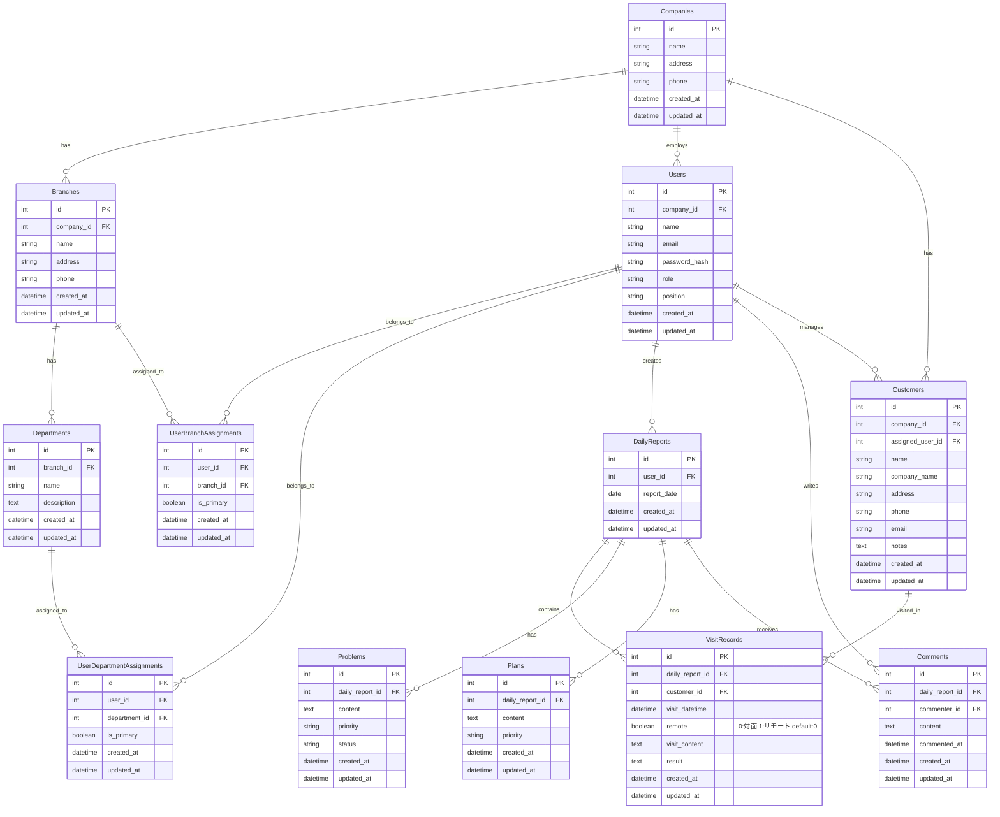

# 営業日報システム 仕様書

## 1. システム概要
営業担当者が日々の営業活動を報告し、上長が確認・コメントできる日報管理システム

## 2. 主要機能

### 2.1 日報作成機能

#### 訪問記録登録
- 1日の日報に対して複数の顧客訪問記録を登録可能
- 各訪問記録には顧客、訪問日時、訪問内容を記載
- 顧客は顧客マスタから選択
- **リモート種別**: 訪問形態を記録
  - `0 (false)`: 対面訪問（デフォルト）
  - `1 (true)`: リモート訪問（オンライン・電話など）

#### Problem（課題・相談）登録
- 現在抱えている課題や上長への相談事項を記載
- 1日報に複数件登録可能

#### Plan（明日やること）登録
- 翌日の営業活動予定を記載
- 1日報に複数件登録可能

### 2.2 コメント機能
- 上長が日報に対してコメント・フィードバックを記載
- 1日報に複数コメント可能
- コメント者（上長）、コメント日時を記録

### 2.3 マスタ管理
- **企業マスタ**: 所属企業情報の管理
- **支店マスタ**: 支店情報の管理
- **部署マスタ**: 部署情報の管理（支店配下）
- **ユーザーマスタ**: 営業担当者・上長・管理者の情報管理
- **顧客マスタ**: 顧客情報の管理

### 2.4 組織管理
- **ユーザー所属管理**: ユーザーは複数の支店・部署に所属可能
- **主所属設定**: 各ユーザーの主たる所属支店・部署を設定可能

## 3. データ構造

### 3.1 エンティティ一覧

#### Companies（企業）
| カラム名 | 型 | 説明 |
|---------|-----|------|
| id | int | 企業ID (PK) |
| name | string | 企業名 |
| address | string | 住所 |
| phone | string | 電話番号 |
| created_at | datetime | 作成日時 |
| updated_at | datetime | 更新日時 |

#### Branches（支店）
| カラム名 | 型 | 説明 |
|---------|-----|------|
| id | int | 支店ID (PK) |
| company_id | int | 所属企業ID (FK) |
| name | string | 支店名 |
| address | string | 住所 |
| phone | string | 電話番号 |
| created_at | datetime | 作成日時 |
| updated_at | datetime | 更新日時 |

#### Departments（部署）
| カラム名 | 型 | 説明 |
|---------|-----|------|
| id | int | 部署ID (PK) |
| branch_id | int | 所属支店ID (FK) |
| name | string | 部署名 |
| description | text | 説明 |
| created_at | datetime | 作成日時 |
| updated_at | datetime | 更新日時 |

#### Users（営業担当者）
| カラム名 | 型 | 説明 |
|---------|-----|------|
| id | int | ユーザーID (PK) |
| company_id | int | 所属企業ID (FK) |
| name | string | 氏名 |
| email | string | メールアドレス |
| password_hash | string | パスワードハッシュ |
| role | string | 役割（営業/上長など） |
| position | string | 役職 |
| created_at | datetime | 作成日時 |
| updated_at | datetime | 更新日時 |

#### Customers（顧客）
| カラム名 | 型 | 説明 |
|---------|-----|------|
| id | int | 顧客ID (PK) |
| company_id | int | 所属企業ID (FK) |
| assigned_user_id | int | 担当営業ID (FK) |
| name | string | 顧客名 |
| company_name | string | 会社名 |
| address | string | 住所 |
| phone | string | 電話番号 |
| email | string | メールアドレス |
| notes | text | 備考 |
| created_at | datetime | 作成日時 |
| updated_at | datetime | 更新日時 |

#### DailyReports（日報）
| カラム名 | 型 | 説明 |
|---------|-----|------|
| id | int | 日報ID (PK) |
| user_id | int | 作成者ID (FK) |
| report_date | date | 報告日 |
| created_at | datetime | 作成日時 |
| updated_at | datetime | 更新日時 |

#### VisitRecords（訪問記録）
| カラム名 | 型 | 説明 |
|---------|-----|------|
| id | int | 訪問記録ID (PK) |
| daily_report_id | int | 日報ID (FK) |
| customer_id | int | 顧客ID (FK) |
| visit_datetime | datetime | 訪問日時 |
| remote | boolean | リモート種別 (0:対面 1:リモート default:0) |
| visit_content | text | 訪問内容 |
| result | text | 結果 |
| created_at | datetime | 作成日時 |
| updated_at | datetime | 更新日時 |

#### Problems（課題・相談）
| カラム名 | 型 | 説明 |
|---------|-----|------|
| id | int | 課題ID (PK) |
| daily_report_id | int | 日報ID (FK) |
| content | text | 課題内容 |
| priority | string | 優先度 |
| status | string | ステータス |
| created_at | datetime | 作成日時 |
| updated_at | datetime | 更新日時 |

#### Plans（明日やること）
| カラム名 | 型 | 説明 |
|---------|-----|------|
| id | int | 計画ID (PK) |
| daily_report_id | int | 日報ID (FK) |
| content | text | 計画内容 |
| priority | string | 優先度 |
| created_at | datetime | 作成日時 |
| updated_at | datetime | 更新日時 |

#### Comments（コメント）
| カラム名 | 型 | 説明 |
|---------|-----|------|
| id | int | コメントID (PK) |
| daily_report_id | int | 日報ID (FK) |
| commenter_id | int | コメント者ID (FK) |
| content | text | コメント内容 |
| commented_at | datetime | コメント日時 |
| created_at | datetime | 作成日時 |
| updated_at | datetime | 更新日時 |

#### UserBranchAssignments（ユーザー支店所属）
| カラム名 | 型 | 説明 |
|---------|-----|------|
| id | int | 所属ID (PK) |
| user_id | int | ユーザーID (FK) |
| branch_id | int | 支店ID (FK) |
| is_primary | boolean | 主たる所属か (default:false) |
| created_at | datetime | 作成日時 |
| updated_at | datetime | 更新日時 |

#### UserDepartmentAssignments（ユーザー部署所属）
| カラム名 | 型 | 説明 |
|---------|-----|------|
| id | int | 所属ID (PK) |
| user_id | int | ユーザーID (FK) |
| department_id | int | 部署ID (FK) |
| is_primary | boolean | 主たる所属か (default:false) |
| created_at | datetime | 作成日時 |
| updated_at | datetime | 更新日時 |

### 3.2 リレーションシップ

#### 主要なリレーションシップ

**組織構造**
- **Companies ← Branches**: 1企業に複数の支店が存在
- **Branches ← Departments**: 1支店に複数の部署が存在
- **Companies ← Users**: 1企業に複数のユーザーが所属（直接所属）
- **Users ⇔ Branches**: ユーザーは複数の支店に所属可能（多対多、中間テーブル: UserBranchAssignments）
- **Users ⇔ Departments**: ユーザーは複数の部署に所属可能（多対多、中間テーブル: UserDepartmentAssignments）
- **UserBranchAssignments.is_primary**: 主たる所属支店を示すフラグ
- **UserDepartmentAssignments.is_primary**: 主たる所属部署を示すフラグ

**日報関連**
- **Users ← DailyReports**: 1ユーザーが複数の日報を作成
- **DailyReports ← VisitRecords**: 1日報に複数の訪問記録
- **DailyReports ← Problems**: 1日報に複数の課題
- **DailyReports ← Plans**: 1日報に複数の計画
- **DailyReports ← Comments**: 1日報に複数のコメント

**顧客関連**
- **Companies ← Customers**: 1企業に複数の顧客が存在
- **Users ← Customers**: 1ユーザーが複数の顧客を担当
- **Customers ← VisitRecords**: 1顧客が複数の訪問記録を持つ

## 4. 想定される活用例

### 4.1 営業活動分析
- 対面訪問 vs リモート訪問の成果比較
- 移動コスト削減効果の測定
- リモート営業の推進状況の可視化
- 顧客ごとの訪問形態傾向の把握

### 4.2 マネジメント機能
- 日報の承認ワークフロー
- 課題の進捗管理
- 計画の実行状況追跡
- チーム全体の活動状況把握

## 5. 将来的な拡張機能候補

- 日報の承認ステータス管理
- 訪問記録の位置情報記録（GPS連携）
- 売上・商談情報の記録
- 月次・週次のサマリーレポート自動生成
- 顧客への次回アクション日の設定とリマインダー
- ダッシュボード機能（KPI可視化）
- モバイルアプリ対応

## 6. 画面設計

@claudedocs/画面定義書.md

## 7. API設計書

@claudedocs/API設計書.md

## 8. テスト仕様書

@claudedocs/テスト仕様書.md

---

**作成日**: 2025-12-31
**バージョン**: 1.0
