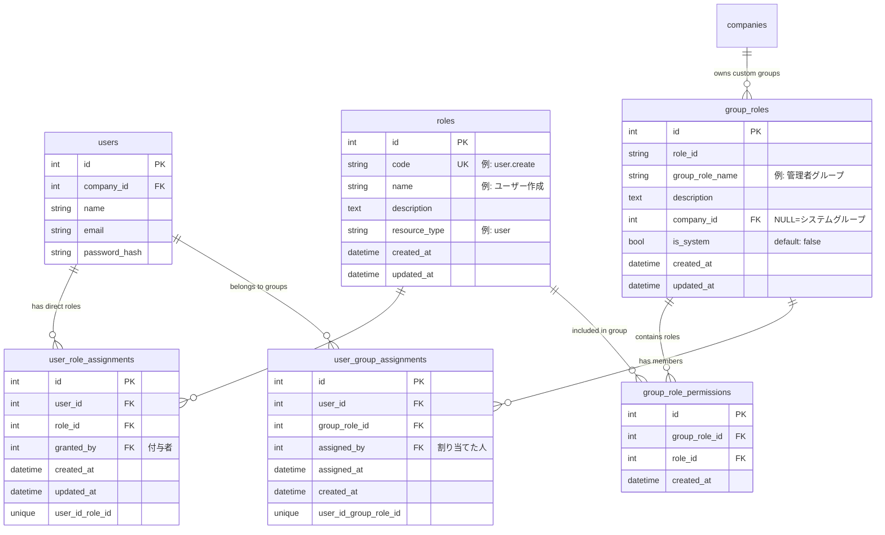

# 権限管理システム 草案

**作成日**: 2026-01-03
**バージョン**: 1.0 (草案)
**ステータス**: 設計検討中

---

## 📖 目次

1. [システム概要](#システム概要)
2. [テーブル設計](#テーブル設計)
3. [ER図](#er図)
4. [権限チェックフロー](#権限チェックフロー)
5. [使用例](#使用例)
6. [実装例](#実装例)

---

## システム概要

Linux風の権限管理システムを構築します。

### 基本コンセプト

**個別権限 + グループ権限**

- **個別権限 (roles)**: 個々の操作権限（例: "user.create", "report.view"）
- **グループ権限 (group_roles)**: 複数の個別権限をまとめたグループ（例: "admin", "manager"）
- **ユーザーへの付与**:
  - 直接個別権限を付与 (user_role_assignments)
  - グループに所属させる (group_role_assignments)

### Linux との対応

| Linux | 本システム |
|-------|-----------|
| ファイル権限 (r, w, x) | roles（個別権限） |
| グループ (admin, users) | group_roles（グループ権限） |
| ユーザー権限 | user_role_assignments（個別権限割り当て） |
| グループ所属 | group_role_assignments（グループ所属） |

### 権限計算式

```
最終権限 = 個別権限 ∪ グループ権限
```

ユーザーが持つ最終的な権限は、直接付与された個別権限とグループ経由で取得した権限の**和集合（UNION）**となります。

---

## テーブル設計

### 1. roles（個別権限一覧）

**テーブルコメント**: `個別権限一覧（どんな権限があるか）`

個々の操作権限を定義するマスタテーブル

| カラム名 | 型 | 制約 | 説明 | 例 |
|---------|-----|------|------|-----|
| `id` | Integer | PK | 権限ID | 1 |
| `code` | String(100) | UNIQUE, NOT NULL | 権限コード | `user.create` |
| `name` | String(255) | NOT NULL | 権限名 | `ユーザー作成` |
| `description` | Text | NULL可 | 権限の説明 | `新しいユーザーを作成する権限` |
| `resource_type` | String(50) | NOT NULL | リソース種別 | `user` |
| `created_at` | DateTime | NOT NULL | 作成日時 | - |
| `updated_at` | DateTime | NOT NULL | 更新日時 | - |

**特徴:**
- `code`: ドット区切りの階層的な命名規則（`{resource}.{action}`）
- `resource_type`: リソースごとにグループ化可能

**例:**
```
user.view       - ユーザー閲覧
user.create     - ユーザー作成
user.update     - ユーザー更新
user.delete     - ユーザー削除
report.view     - レポート閲覧
report.create   - レポート作成
report.approve  - レポート承認
```

---

### 2. group_roles（グループ権限一覧）

**テーブルコメント**: `グループ一覧（どんなグループがあるか）`

複数の個別権限をまとめたグループを定義するテーブル

| カラム名 | 型 | 制約 | 説明 | 例 |
|---------|-----|------|------|-----|
| `id` | Integer | PK | グループID | 1 |
| `code` | String(100) | UNIQUE, NOT NULL | グループコード | `admin` |
| `name` | String(255) | NOT NULL | グループ名 | `管理者グループ` |
| `description` | Text | NULL可 | グループの説明 | `システム管理者用のグループ` |
| `company_id` | Integer | FK, NULL可 | 企業ID | `NULL` or `123` |
| `is_system` | Boolean | NOT NULL, default: false | システムグループか | `true` |
| `created_at` | DateTime | NOT NULL | 作成日時 | - |
| `updated_at` | DateTime | NOT NULL | 更新日時 | - |

**制約:**
- `company_id` が `NULL` の場合はシステムグループ（全企業共通）
- `company_id` に値がある場合は企業専用グループ

**2種類のグループ:**

| 種類 | company_id | is_system | 用途 |
|------|-----------|-----------|------|
| **システムグループ** | `NULL` | `true` | 全企業共通の標準グループ（admin, manager等） |
| **企業専用グループ** | 企業ID | `false` | 各企業がカスタマイズ可能なグループ |

---

### 3. group_role_permissions（グループに含まれる権限）

**テーブルコメント**: `グループに含まれる権限（グループ⇔権限）`

グループに含まれる個別権限の中間テーブル

| カラム名 | 型 | 制約 | 説明 |
|---------|-----|------|------|
| `id` | Integer | PK | ID |
| `group_role_id` | Integer | FK, NOT NULL | グループID（→ group_roles.id） |
| `role_id` | Integer | FK, NOT NULL | 権限ID（→ roles.id） |
| `created_at` | DateTime | NOT NULL | 作成日時 |

**制約:**
- `UNIQUE(group_role_id, role_id)` - 同じグループに同じ権限を重複追加不可
- `ON DELETE CASCADE` - グループ削除時、このレコードも削除
- `ON DELETE CASCADE` - 権限削除時、このレコードも削除

**役割:**
- グループと個別権限の多対多リレーションを管理
- 例: "admin"グループには "user.create", "user.update", "user.delete" が含まれる

---

### 4. user_role_assignments（ユーザーへの個別権限割り当て）

**テーブルコメント**: `ユーザーへの個別権限割り当て（ユーザー⇔権限）`

ユーザーに直接割り当てられた個別権限

| カラム名 | 型 | 制約 | 説明 |
|---------|-----|------|------|
| `id` | Integer | PK | ID |
| `user_id` | Integer | FK, NOT NULL | ユーザーID（→ users.id） |
| `role_id` | Integer | FK, NOT NULL | 権限ID（→ roles.id） |
| `granted_by` | Integer | FK, NULL可 | 付与者ID（→ users.id） |
| `granted_at` | DateTime | NOT NULL | 付与日時 |
| `reason` | Text | NULL可 | 付与理由（監査用） |
| `created_at` | DateTime | NOT NULL | 作成日時 |

**制約:**
- `UNIQUE(user_id, role_id)` - 同じユーザーに同じ権限を重複付与不可
- `ON DELETE CASCADE` - ユーザー削除時、このレコードも削除
- `ON DELETE CASCADE` - 権限削除時、このレコードも削除

**監査機能:**
- `granted_by`: 誰が権限を付与したか
- `granted_at`: いつ権限が付与されたか
- `reason`: なぜ権限を付与したか（コンプライアンス対応）

**使用例:**
- 特定ユーザーに一時的な権限を付与
- グループに含まれない特別な権限を付与

---

### 5. user_group_assignments（ユーザーのグループ所属）

**テーブルコメント**: `ユーザーのグループ所属（ユーザー⇔グループ）`

ユーザーが所属するグループを管理するテーブル

| カラム名 | 型 | 制約 | 説明 |
|---------|-----|------|------|
| `id` | Integer | PK | ID |
| `user_id` | Integer | FK, NOT NULL | ユーザーID（→ users.id） |
| `group_role_id` | Integer | FK, NOT NULL | グループID（→ group_roles.id） |
| `assigned_by` | Integer | FK, NULL可 | 割り当てた人（→ users.id） |
| `assigned_at` | DateTime | NOT NULL | 割り当て日時 |
| `created_at` | DateTime | NOT NULL | 作成日時 |

**制約:**
- `UNIQUE(user_id, group_role_id)` - 同じユーザーを同じグループに重複追加不可
- `ON DELETE CASCADE` - ユーザー削除時、このレコードも削除
- `ON DELETE CASCADE` - グループ削除時、このレコードも削除

**監査機能:**
- `assigned_by`: 誰がグループに追加したか
- `assigned_at`: いつグループに追加されたか

**役割:**
- ユーザーとグループの多対多リレーションを管理
- 1ユーザーは複数のグループに所属可能

---

## ER図



---

## 権限チェックフロー

### SQLクエリ例

```sql
-- ユーザーの最終権限を取得

-- 1. 個別権限（直接付与）
SELECT roles.code
FROM roles
JOIN user_role_assignments ON user_role_assignments.role_id = roles.id
WHERE user_role_assignments.user_id = :user_id

UNION

-- 2. グループ権限（グループ経由）
SELECT roles.code
FROM roles
JOIN group_role_permissions ON group_role_permissions.role_id = roles.id
JOIN user_group_assignments ON user_group_assignments.group_role_id = group_role_permissions.group_role_id
WHERE user_group_assignments.user_id = :user_id
```

### Python実装例

```python
async def get_user_permissions(db: AsyncSession, user_id: int) -> Set[str]:
    """
    ユーザーの最終権限を取得

    Returns:
        Set[str]: 権限コードのセット（例: {"user.create", "report.view"}）
    """
    # 1. 個別権限を取得
    direct_query = (
        select(Role.code)
        .join(UserRoleAssignment, UserRoleAssignment.role_id == Role.id)
        .where(UserRoleAssignment.user_id == user_id)
    )

    # 2. グループ権限を取得
    group_query = (
        select(Role.code)
        .join(GroupRolePermission, GroupRolePermission.role_id == Role.id)
        .join(UserGroupAssignment, UserGroupAssignment.group_role_id == GroupRolePermission.group_role_id)
        .where(UserGroupAssignment.user_id == user_id)
    )

    # 3. UNION で統合
    combined_query = direct_query.union(group_query)
    result = await db.execute(combined_query)
    permissions = result.scalars().all()

    return set(permissions)
```

### 権限チェック関数

```python
async def check_permission(db: AsyncSession, user_id: int, required_permission: str) -> bool:
    """
    ユーザーが特定の権限を持っているかチェック

    Args:
        db: データベースセッション
        user_id: ユーザーID
        required_permission: 必要な権限コード（例: "user.create"）

    Returns:
        bool: 権限があればTrue、なければFalse
    """
    user_permissions = await get_user_permissions(db, user_id)
    return required_permission in user_permissions
```

---

## 使用例

### 例1: システムグループの作成

```python
# Step 1: 個別権限を作成
roles = [
    Role(code="user.view", name="ユーザー閲覧", resource_type="user"),
    Role(code="user.create", name="ユーザー作成", resource_type="user"),
    Role(code="user.update", name="ユーザー更新", resource_type="user"),
    Role(code="user.delete", name="ユーザー削除", resource_type="user"),
    Role(code="report.view", name="レポート閲覧", resource_type="report"),
    Role(code="report.create", name="レポート作成", resource_type="report"),
]
db.add_all(roles)
await db.flush()

# Step 2: グループを作成
admin_group = GroupRole(
    code="admin",
    name="管理者グループ",
    description="システム管理者用のグループ",
    company_id=None,  # システムグループ
    is_system=True
)
db.add(admin_group)
await db.flush()

# Step 3: グループに権限を追加
group_permissions = [
    GroupRolePermission(group_role_id=admin_group.id, role_id=role.id)
    for role in roles
]
db.add_all(group_permissions)
await db.commit()
```

---

### 例2: ユーザーへの権限付与

#### パターンA: グループに所属させる

```python
# ユーザーを "admin" グループに追加
assignment = UserGroupAssignment(
    user_id=user.id,
    group_role_id=admin_group.id,
    assigned_by=current_admin.id,
    assigned_at=datetime.now()
)
db.add(assignment)
await db.commit()

# 結果: ユーザーは admin グループの全権限を取得
# → user.view, user.create, user.update, user.delete, report.view, report.create
```

#### パターンB: 個別権限を直接付与

```python
# 特定の権限だけを直接付与
assignment = UserRoleAssignment(
    user_id=user.id,
    role_id=report_approve_role.id,
    granted_by=current_admin.id,
    granted_at=datetime.now(),
    reason="プロジェクトX対応のため一時的に承認権限を付与"
)
db.add(assignment)
await db.commit()

# 結果: ユーザーは report.approve 権限を直接取得
```

---

### 例3: 企業専用グループの作成

```python
# 企業専用の "営業マネージャー" グループを作成
sales_manager_group = GroupRole(
    code="sales_manager",
    name="営業マネージャー",
    description="営業部門のマネージャー用グループ",
    company_id=company.id,  # 企業専用グループ
    is_system=False
)
db.add(sales_manager_group)
await db.flush()

# グループに必要な権限を追加
permissions_for_sales_manager = [
    "report.view",
    "report.view_all",
    "report.approve",
    "user.view",
]

for perm_code in permissions_for_sales_manager:
    role = await db.execute(select(Role).where(Role.code == perm_code))
    role = role.scalar_one()

    permission = GroupRolePermission(
        group_role_id=sales_manager_group.id,
        role_id=role.id
    )
    db.add(permission)

await db.commit()
```

---

## 実装例

### FastAPI エンドポイントでの権限チェック

```python
from fastapi import APIRouter, Depends, HTTPException, status
from sqlalchemy.ext.asyncio import AsyncSession
from app.database import get_db
from app.models.user import User
from app.auth.dependencies import get_current_user

router = APIRouter()

async def require_permission(required_permission: str):
    """
    権限チェック用のDependency

    使い方:
        @router.post("/users")
        async def create_user(
            current_user: User = Depends(require_permission("user.create"))
        ):
            ...
    """
    async def permission_checker(
        current_user: User = Depends(get_current_user),
        db: AsyncSession = Depends(get_db)
    ) -> User:
        # ユーザーの権限を取得
        user_permissions = await get_user_permissions(db, current_user.id)

        # 権限チェック
        if required_permission not in user_permissions:
            raise HTTPException(
                status_code=status.HTTP_403_FORBIDDEN,
                detail=f"権限が不足しています: {required_permission}"
            )

        return current_user

    return permission_checker


# エンドポイント例
@router.post("/api/users")
async def create_user(
    user_data: UserCreate,
    current_user: User = Depends(require_permission("user.create")),
    db: AsyncSession = Depends(get_db)
):
    """
    ユーザー作成エンドポイント

    必要権限: user.create
    """
    # current_user は権限チェック済み
    new_user = User(**user_data.dict())
    db.add(new_user)
    await db.commit()

    return {"id": new_user.id, "name": new_user.name}
```

---

## まとめ

### ✅ この設計の利点

1. **柔軟性**: グループ権限 + 個別権限の組み合わせが可能
2. **監査性**: 誰がいつ権限を付与したか完全に記録
3. **スケーラビリティ**: 企業ごとのカスタムグループ作成可能
4. **Linux風**: 馴染みのある権限モデルで理解しやすい
5. **シンプル**: 明確なテーブル構造で保守性が高い
6. **拡張性**: 新しい権限やグループを動的に追加可能

### 📊 テーブル数

- **マスタテーブル**: 2個（roles, group_roles）
- **中間テーブル**: 3個（group_role_permissions, user_role_assignments, user_group_assignments）
- **合計**: 5テーブル

---

**次のステップ**: この草案をレビューして、承認後に実装へ進みます。
