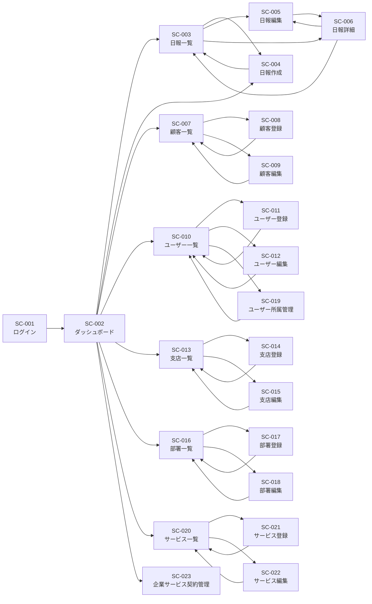

# 営業日報システム 画面定義書

## 目次
1. [ログイン画面](#1-ログイン画面)
2. [ダッシュボード](#2-ダッシュボード)
3. [日報一覧画面](#3-日報一覧画面)
4. [日報作成画面](#4-日報作成画面)
5. [日報編集画面](#5-日報編集画面)
6. [日報詳細画面](#6-日報詳細画面)
7. [顧客マスタ一覧画面](#7-顧客マスタ一覧画面)
8. [顧客マスタ登録画面](#8-顧客マスタ登録画面)
9. [顧客マスタ編集画面](#9-顧客マスタ編集画面)
10. [ユーザーマスタ一覧画面](#10-ユーザーマスタ一覧画面)
11. [ユーザーマスタ登録画面](#11-ユーザーマスタ登録画面)
12. [ユーザーマスタ編集画面](#12-ユーザーマスタ編集画面)
13. [支店マスタ一覧画面](#13-支店マスタ一覧画面)
14. [支店マスタ登録画面](#14-支店マスタ登録画面)
15. [支店マスタ編集画面](#15-支店マスタ編集画面)
16. [部署マスタ一覧画面](#16-部署マスタ一覧画面)
17. [部署マスタ登録画面](#17-部署マスタ登録画面)
18. [部署マスタ編集画面](#18-部署マスタ編集画面)
19. [ユーザー所属管理画面](#19-ユーザー所属管理画面)
20. [サービスマスタ一覧画面](#20-サービスマスタ一覧画面)
21. [サービスマスタ登録画面](#21-サービスマスタ登録画面)
22. [サービスマスタ編集画面](#22-サービスマスタ編集画面)
23. [企業サービス契約管理画面](#23-企業サービス契約管理画面)

---

## 1. ログイン画面

### 画面ID
`SC-001`

### 画面名
ログイン画面

### 画面概要
ユーザーがシステムにログインするための認証画面

### アクセス権限
- 全ユーザー（未認証状態）

### 画面項目

| 項目名 | 項目ID | 型 | 必須 | 制約 | 初期値 | 備考 |
|--------|--------|-----|------|------|--------|------|
| メールアドレス | email | text | ○ | メール形式 | - | ログインID |
| パスワード | password | password | ○ | 8文字以上 | - | マスク表示 |
| ログイン保持 | remember_me | checkbox | - | - | false | チェックボックス |

### 操作

| 操作名 | 操作ID | 処理内容 |
|--------|--------|----------|
| ログイン | BTN-001-01 | 認証処理を実行し、成功時はダッシュボードへ遷移 |
| パスワードを忘れた場合 | LINK-001-01 | パスワードリセット画面へ遷移 |

### 画面遷移

| 遷移元 | 遷移先 | 条件 |
|--------|--------|------|
| - | SC-002（ダッシュボード） | ログイン成功時 |
| - | パスワードリセット画面 | 「パスワードを忘れた場合」リンククリック |

### バリデーション

| 項目 | ルール | エラーメッセージ |
|------|--------|------------------|
| メールアドレス | 必須入力 | メールアドレスを入力してください |
| メールアドレス | メール形式 | 正しいメールアドレス形式で入力してください |
| パスワード | 必須入力 | パスワードを入力してください |
| 認証 | 認証失敗 | メールアドレスまたはパスワードが正しくありません |

### 備考
- ログイン失敗5回でアカウントロック（10分間）
- HTTPS通信必須

---

## 2. ダッシュボード

### 画面ID
`SC-002`

### 画面名
ダッシュボード（トップ画面）

### 画面概要
ログイン後の初期画面。本日の日報状況、未読コメント、今週の活動サマリーを表示

### アクセス権限
- 全ての認証済みユーザー

### 画面項目

| セクション名 | 項目名 | 項目ID | 型 | 備考 |
|-------------|--------|--------|-----|------|
| 本日の日報 | 日報作成状況 | status_today | badge | 未作成/作成済 |
| 本日の日報 | 訪問件数 | visit_count_today | number | 本日の訪問記録数 |
| 本日の日報 | 課題数 | problem_count_today | number | 未解決課題数 |
| 通知 | 未読コメント | unread_comments | list | 上長からのコメント一覧 |
| 今週のサマリー | 訪問件数（週） | visit_count_week | number | 今週の総訪問件数 |
| 今週のサマリー | 対面/リモート比率 | visit_ratio_week | chart | 円グラフ表示 |
| 今週のサマリー | 顧客訪問数 | customer_count_week | number | 訪問した顧客数 |
| クイックアクション | - | - | buttons | 日報作成、顧客登録などのボタン |

### 操作

| 操作名 | 操作ID | 処理内容 |
|--------|--------|----------|
| 日報作成 | BTN-002-01 | 日報作成画面へ遷移 |
| 日報一覧表示 | BTN-002-02 | 日報一覧画面へ遷移 |
| 顧客一覧表示 | BTN-002-03 | 顧客マスタ一覧画面へ遷移 |
| 通知詳細表示 | LINK-002-01 | 該当日報詳細画面へ遷移 |

### 画面遷移

| 遷移元 | 遷移先 | 条件 |
|--------|--------|------|
| - | SC-004（日報作成画面） | 「日報作成」ボタンクリック |
| - | SC-003（日報一覧画面） | 「日報一覧」ボタンクリック |
| - | SC-007（顧客マスタ一覧画面） | 「顧客一覧」ボタンクリック |
| - | SC-006（日報詳細画面） | 通知クリック |

### バリデーション
なし（表示のみ）

### 備考
- データは自動更新（30秒ごと）
- 管理者の場合は全社サマリーも表示

---

## 3. 日報一覧画面

### 画面ID
`SC-003`

### 画面名
日報一覧画面

### 画面概要
自分が作成した日報の一覧を表示。上長の場合は部下の日報も表示可能

### アクセス権限
- 全ての認証済みユーザー
- 上長：部下の日報も閲覧可能

### 画面項目

| 項目名 | 項目ID | 型 | 必須 | 備考 |
|--------|--------|-----|------|------|
| 検索期間（開始） | search_date_from | date | - | デフォルト：1ヶ月前 |
| 検索期間（終了） | search_date_to | date | - | デフォルト：今日 |
| 対象ユーザー | search_user_id | select | - | 上長のみ表示 |
| 一覧テーブル | report_list | table | - | ページネーション付き |

#### 一覧テーブル列

| 列名 | 項目ID | 表示内容 | ソート | 備考 |
|------|--------|----------|--------|------|
| 報告日 | report_date | YYYY/MM/DD | ○ | 降順デフォルト |
| 報告者 | user_name | 氏名 | ○ | 上長の場合のみ表示 |
| 訪問件数 | visit_count | 数値 | ○ | - |
| 課題数 | problem_count | 数値 | ○ | - |
| コメント数 | comment_count | 数値 | ○ | - |
| 操作 | actions | ボタン | - | 詳細/編集/削除 |

### 操作

| 操作名 | 操作ID | 処理内容 |
|--------|--------|----------|
| 検索 | BTN-003-01 | 検索条件で日報を絞り込み |
| クリア | BTN-003-02 | 検索条件をクリア |
| 新規作成 | BTN-003-03 | 日報作成画面へ遷移 |
| 詳細表示 | BTN-003-04 | 日報詳細画面へ遷移 |
| 編集 | BTN-003-05 | 日報編集画面へ遷移 |
| 削除 | BTN-003-06 | 確認ダイアログ表示後、日報を削除 |

### 画面遷移

| 遷移元 | 遷移先 | 条件 |
|--------|--------|------|
| - | SC-004（日報作成画面） | 「新規作成」ボタンクリック |
| - | SC-006（日報詳細画面） | 「詳細」ボタンクリック |
| - | SC-005（日報編集画面） | 「編集」ボタンクリック |

### バリデーション

| 項目 | ルール | エラーメッセージ |
|------|--------|------------------|
| 検索期間 | 終了日 ≥ 開始日 | 終了日は開始日以降を指定してください |
| 削除 | 他人の日報 | 他人の日報は削除できません |

### 備考
- 1ページあたり20件表示
- エクスポート機能（CSV、Excel）を将来実装予定

---

## 4. 日報作成画面

### 画面ID
`SC-004`

### 画面名
日報作成画面

### 画面概要
新規日報を作成する画面。訪問記録、課題、計画を登録

### アクセス権限
- 営業担当者（role: sales）

### 画面項目

#### 基本情報

| 項目名 | 項目ID | 型 | 必須 | 制約 | 初期値 | 備考 |
|--------|--------|-----|------|------|--------|------|
| 報告日 | report_date | date | ○ | - | 今日 | - |

#### 訪問記録セクション（複数行追加可能）

| 項目名 | 項目ID | 型 | 必須 | 制約 | 初期値 | 備考 |
|--------|--------|-----|------|------|--------|------|
| 顧客 | customer_id | select | ○ | - | - | 顧客マスタから選択 |
| 訪問日時 | visit_datetime | datetime | ○ | - | 現在時刻 | - |
| リモート種別 | remote | radio | ○ | - | false | 対面/リモート |
| 訪問内容 | visit_content | textarea | ○ | 1000文字以内 | - | - |
| 結果 | result | textarea | - | 1000文字以内 | - | - |

#### 課題・相談セクション（複数行追加可能）

| 項目名 | 項目ID | 型 | 必須 | 制約 | 初期値 | 備考 |
|--------|--------|-----|------|------|--------|------|
| 課題内容 | problem_content | textarea | ○ | 500文字以内 | - | - |
| 優先度 | problem_priority | select | ○ | 高/中/低 | 中 | - |

#### 明日やることセクション（複数行追加可能）

| 項目名 | 項目ID | 型 | 必須 | 制約 | 初期値 | 備考 |
|--------|--------|-----|------|------|--------|------|
| 計画内容 | plan_content | textarea | ○ | 500文字以内 | - | - |
| 優先度 | plan_priority | select | ○ | 高/中/低 | 中 | - |

### 操作

| 操作名 | 操作ID | 処理内容 |
|--------|--------|----------|
| 訪問記録追加 | BTN-004-01 | 訪問記録の入力行を追加 |
| 訪問記録削除 | BTN-004-02 | 該当の訪問記録行を削除 |
| 課題追加 | BTN-004-03 | 課題の入力行を追加 |
| 課題削除 | BTN-004-04 | 該当の課題行を削除 |
| 計画追加 | BTN-004-05 | 計画の入力行を追加 |
| 計画削除 | BTN-004-06 | 該当の計画行を削除 |
| 下書き保存 | BTN-004-07 | 下書きとして保存 |
| 登録 | BTN-004-08 | 日報を登録して一覧画面へ遷移 |
| キャンセル | BTN-004-09 | 確認ダイアログ表示後、一覧画面へ遷移 |

### 画面遷移

| 遷移元 | 遷移先 | 条件 |
|--------|--------|------|
| - | SC-003（日報一覧画面） | 「登録」ボタンクリック（登録成功時） |
| - | SC-003（日報一覧画面） | 「キャンセル」ボタンクリック |

### バリデーション

| 項目 | ルール | エラーメッセージ |
|------|--------|------------------|
| 報告日 | 必須入力 | 報告日を入力してください |
| 報告日 | 未来日不可 | 報告日は本日以前を指定してください |
| 訪問記録 | 最低1件必須 | 訪問記録を1件以上登録してください |
| 顧客 | 必須選択 | 顧客を選択してください |
| 訪問日時 | 必須入力 | 訪問日時を入力してください |
| 訪問内容 | 必須入力 | 訪問内容を入力してください |
| 訪問内容 | 1000文字以内 | 訪問内容は1000文字以内で入力してください |
| 課題内容 | 必須入力 | 課題内容を入力してください |
| 課題内容 | 500文字以内 | 課題内容は500文字以内で入力してください |
| 計画内容 | 必須入力 | 計画内容を入力してください |
| 計画内容 | 500文字以内 | 計画内容は500文字以内で入力してください |

### 備考
- 訪問記録、課題、計画は最大10件まで追加可能
- 下書き保存時はバリデーションを実施しない
- 顧客が見つからない場合は、その場で顧客登録画面をモーダルで開く機能を検討

---

## 5. 日報編集画面

### 画面ID
`SC-005`

### 画面名
日報編集画面

### 画面概要
既存の日報を編集する画面。レイアウトは日報作成画面と同一

### アクセス権限
- 日報作成者本人のみ
- 報告日の翌々日まで編集可能

### 画面項目
日報作成画面（SC-004）と同一

### 操作
日報作成画面（SC-004）と同一（「登録」が「更新」に変更）

### 画面遷移

| 遷移元 | 遷移先 | 条件 |
|--------|--------|------|
| - | SC-006（日報詳細画面） | 「更新」ボタンクリック（更新成功時） |
| - | SC-006（日報詳細画面） | 「キャンセル」ボタンクリック |

### バリデーション
日報作成画面（SC-004）と同一

### 備考
- 編集期限を過ぎた日報は編集不可（エラーメッセージ表示）
- コメントが既に付いている場合は警告メッセージを表示

---

## 6. 日報詳細画面

### 画面ID
`SC-006`

### 画面名
日報詳細画面

### 画面概要
日報の詳細情報を表示。上長はコメントを追加可能

### アクセス権限
- 日報作成者本人
- 上長（部下の日報を閲覧可能）

### 画面項目

#### 基本情報

| 項目名 | 項目ID | 型 | 備考 |
|--------|--------|-----|------|
| 報告日 | report_date | text | 読み取り専用 |
| 報告者 | user_name | text | 読み取り専用 |
| 作成日時 | created_at | text | 読み取り専用 |
| 更新日時 | updated_at | text | 読み取り専用 |

#### 訪問記録一覧

| 項目名 | 項目ID | 型 | 備考 |
|--------|--------|-----|------|
| 顧客名 | customer_name | text | - |
| 訪問日時 | visit_datetime | text | - |
| リモート種別 | remote | badge | 対面/リモート |
| 訪問内容 | visit_content | text | - |
| 結果 | result | text | - |

#### 課題・相談一覧

| 項目名 | 項目ID | 型 | 備考 |
|--------|--------|-----|------|
| 課題内容 | problem_content | text | - |
| 優先度 | problem_priority | badge | 高/中/低 |
| ステータス | problem_status | badge | 未解決/解決済 |

#### 明日やること一覧

| 項目名 | 項目ID | 型 | 備考 |
|--------|--------|-----|------|
| 計画内容 | plan_content | text | - |
| 優先度 | plan_priority | badge | 高/中/低 |

#### コメント一覧

| 項目名 | 項目ID | 型 | 備考 |
|--------|--------|-----|------|
| コメント者 | commenter_name | text | - |
| コメント日時 | commented_at | text | - |
| コメント内容 | comment_content | text | - |

#### コメント入力（上長のみ表示）

| 項目名 | 項目ID | 型 | 必須 | 制約 |
|--------|--------|-----|------|------|
| コメント | comment_input | textarea | ○ | 1000文字以内 |

### 操作

| 操作名 | 操作ID | 処理内容 | 表示条件 |
|--------|--------|----------|----------|
| 編集 | BTN-006-01 | 日報編集画面へ遷移 | 作成者本人かつ編集期限内 |
| 削除 | BTN-006-02 | 確認ダイアログ表示後、削除して一覧へ遷移 | 作成者本人 |
| コメント投稿 | BTN-006-03 | コメントを投稿 | 上長のみ |
| 戻る | BTN-006-04 | 日報一覧画面へ遷移 | 全員 |

### 画面遷移

| 遷移元 | 遷移先 | 条件 |
|--------|--------|------|
| - | SC-005（日報編集画面） | 「編集」ボタンクリック |
| - | SC-003（日報一覧画面） | 「削除」ボタンクリック（削除成功時） |
| - | SC-003（日報一覧画面） | 「戻る」ボタンクリック |

### バリデーション

| 項目 | ルール | エラーメッセージ |
|------|--------|------------------|
| コメント | 必須入力 | コメントを入力してください |
| コメント | 1000文字以内 | コメントは1000文字以内で入力してください |

### 備考
- コメント投稿時、作成者に通知メール送信（将来実装予定）
- 印刷機能を将来実装予定

---

## 7. 顧客マスタ一覧画面

### 画面ID
`SC-007`

### 画面名
顧客マスタ一覧画面

### 画面概要
顧客情報の一覧を表示。検索・編集・削除が可能

### アクセス権限
- 全ての認証済みユーザー

### 画面項目

| 項目名 | 項目ID | 型 | 必須 | 備考 |
|--------|--------|-----|------|------|
| 検索キーワード | search_keyword | text | - | 顧客名、会社名で部分一致検索 |
| 担当営業 | search_assigned_user | select | - | 自分/全員 |
| 一覧テーブル | customer_list | table | - | ページネーション付き |

#### 一覧テーブル列

| 列名 | 項目ID | 表示内容 | ソート | 備考 |
|------|--------|----------|--------|------|
| 顧客名 | customer_name | テキスト | ○ | - |
| 会社名 | company_name | テキスト | ○ | - |
| 電話番号 | phone | テキスト | - | - |
| メールアドレス | email | テキスト | - | - |
| 担当営業 | assigned_user_name | テキスト | ○ | - |
| 最終訪問日 | last_visit_date | 日付 | ○ | - |
| 操作 | actions | ボタン | - | 詳細/編集/削除 |

### 操作

| 操作名 | 操作ID | 処理内容 |
|--------|--------|----------|
| 検索 | BTN-007-01 | 検索条件で顧客を絞り込み |
| クリア | BTN-007-02 | 検索条件をクリア |
| 新規登録 | BTN-007-03 | 顧客マスタ登録画面へ遷移 |
| 編集 | BTN-007-04 | 顧客マスタ編集画面へ遷移 |
| 削除 | BTN-007-05 | 確認ダイアログ表示後、顧客を削除 |

### 画面遷移

| 遷移元 | 遷移先 | 条件 |
|--------|--------|------|
| - | SC-008（顧客マスタ登録画面） | 「新規登録」ボタンクリック |
| - | SC-009（顧客マスタ編集画面） | 「編集」ボタンクリック |

### バリデーション

| 項目 | ルール | エラーメッセージ |
|------|--------|------------------|
| 削除 | 訪問記録が存在する顧客 | この顧客には訪問記録が存在するため削除できません |

### 備考
- 1ページあたり20件表示
- CSV一括インポート機能を将来実装予定

---

## 8. 顧客マスタ登録画面

### 画面ID
`SC-008`

### 画面名
顧客マスタ登録画面

### 画面概要
新規顧客を登録する画面

### アクセス権限
- 全ての認証済みユーザー

### 画面項目

| 項目名 | 項目ID | 型 | 必須 | 制約 | 初期値 | 備考 |
|--------|--------|-----|------|------|--------|------|
| 顧客名 | customer_name | text | ○ | 100文字以内 | - | - |
| 会社名 | company_name | text | ○ | 200文字以内 | - | - |
| 住所 | address | text | - | 300文字以内 | - | - |
| 電話番号 | phone | tel | - | ハイフンあり | - | 例: 03-1234-5678 |
| メールアドレス | email | email | - | メール形式 | - | - |
| 担当営業 | assigned_user_id | select | ○ | - | ログインユーザー | 営業マスタから選択 |
| 備考 | notes | textarea | - | 1000文字以内 | - | - |

### 操作

| 操作名 | 操作ID | 処理内容 |
|--------|--------|----------|
| 登録 | BTN-008-01 | 顧客を登録して一覧画面へ遷移 |
| キャンセル | BTN-008-02 | 確認ダイアログ表示後、一覧画面へ遷移 |

### 画面遷移

| 遷移元 | 遷移先 | 条件 |
|--------|--------|------|
| - | SC-007（顧客マスタ一覧画面） | 「登録」ボタンクリック（登録成功時） |
| - | SC-007（顧客マスタ一覧画面） | 「キャンセル」ボタンクリック |

### バリデーション

| 項目 | ルール | エラーメッセージ |
|------|--------|------------------|
| 顧客名 | 必須入力 | 顧客名を入力してください |
| 顧客名 | 100文字以内 | 顧客名は100文字以内で入力してください |
| 会社名 | 必須入力 | 会社名を入力してください |
| 会社名 | 200文字以内 | 会社名は200文字以内で入力してください |
| 電話番号 | 電話番号形式 | 正しい電話番号形式で入力してください（例: 03-1234-5678） |
| メールアドレス | メール形式 | 正しいメールアドレス形式で入力してください |
| 担当営業 | 必須選択 | 担当営業を選択してください |

### 備考
- 同一顧客名・会社名の重複チェックを実施（警告のみ）

---

## 9. 顧客マスタ編集画面

### 画面ID
`SC-009`

### 画面名
顧客マスタ編集画面

### 画面概要
既存顧客情報を編集する画面。レイアウトは顧客マスタ登録画面と同一

### アクセス権限
- 全ての認証済みユーザー

### 画面項目
顧客マスタ登録画面（SC-008）と同一

### 操作
顧客マスタ登録画面（SC-008）と同一（「登録」が「更新」に変更）

### 画面遷移

| 遷移元 | 遷移先 | 条件 |
|--------|--------|------|
| - | SC-007（顧客マスタ一覧画面） | 「更新」ボタンクリック（更新成功時） |
| - | SC-007（顧客マスタ一覧画面） | 「キャンセル」ボタンクリック |

### バリデーション
顧客マスタ登録画面（SC-008）と同一

### 備考
なし

---

## 10. ユーザーマスタ一覧画面

### 画面ID
`SC-010`

### 画面名
ユーザーマスタ一覧画面（管理者用）

### 画面概要
システムユーザー（営業担当者・上長）の一覧を表示

### アクセス権限
- 管理者（role: admin）のみ

### 画面項目

| 項目名 | 項目ID | 型 | 必須 | 備考 |
|--------|--------|-----|------|------|
| 検索キーワード | search_keyword | text | - | 氏名、メールアドレスで部分一致検索 |
| 役割 | search_role | select | - | 全員/営業/上長/管理者 |
| 一覧テーブル | user_list | table | - | ページネーション付き |

#### 一覧テーブル列

| 列名 | 項目ID | 表示内容 | ソート | 備考 |
|------|--------|----------|--------|------|
| 氏名 | user_name | テキスト | ○ | - |
| メールアドレス | email | テキスト | ○ | - |
| 役割 | role | バッジ | ○ | 営業/上長/管理者 |
| 役職 | position | テキスト | - | - |
| 登録日 | created_at | 日付 | ○ | - |
| ステータス | status | バッジ | ○ | 有効/無効 |
| 操作 | actions | ボタン | - | 編集/削除 |

### 操作

| 操作名 | 操作ID | 処理内容 |
|--------|--------|----------|
| 検索 | BTN-010-01 | 検索条件でユーザーを絞り込み |
| クリア | BTN-010-02 | 検索条件をクリア |
| 新規登録 | BTN-010-03 | ユーザーマスタ登録画面へ遷移 |
| 編集 | BTN-010-04 | ユーザーマスタ編集画面へ遷移 |
| 削除 | BTN-010-05 | 確認ダイアログ表示後、ユーザーを削除 |

### 画面遷移

| 遷移元 | 遷移先 | 条件 |
|--------|--------|------|
| - | SC-011（ユーザーマスタ登録画面） | 「新規登録」ボタンクリック |
| - | SC-012（ユーザーマスタ編集画面） | 「編集」ボタンクリック |

### バリデーション

| 項目 | ルール | エラーメッセージ |
|------|--------|------------------|
| 削除 | 自分自身 | 自分自身は削除できません |
| 削除 | 日報作成済みユーザー | このユーザーには日報が存在するため削除できません |

### 備考
- 1ページあたり20件表示

---

## 11. ユーザーマスタ登録画面

### 画面ID
`SC-011`

### 画面名
ユーザーマスタ登録画面（管理者用）

### 画面概要
新規ユーザーを登録する画面

### アクセス権限
- 管理者（role: admin）のみ

### 画面項目

| 項目名 | 項目ID | 型 | 必須 | 制約 | 初期値 | 備考 |
|--------|--------|-----|------|------|--------|------|
| 氏名 | user_name | text | ○ | 100文字以内 | - | - |
| メールアドレス | email | email | ○ | メール形式、一意 | - | ログインIDとして使用 |
| パスワード | password | password | ○ | 8文字以上 | - | - |
| パスワード（確認） | password_confirm | password | ○ | passwordと一致 | - | - |
| 役割 | role | select | ○ | 営業/上長/管理者 | 営業 | - |
| 役職 | position | text | - | 100文字以内 | - | - |

### 操作

| 操作名 | 操作ID | 処理内容 |
|--------|--------|----------|
| 登録 | BTN-011-01 | ユーザーを登録して一覧画面へ遷移 |
| キャンセル | BTN-011-02 | 確認ダイアログ表示後、一覧画面へ遷移 |

### 画面遷移

| 遷移元 | 遷移先 | 条件 |
|--------|--------|------|
| - | SC-010（ユーザーマスタ一覧画面） | 「登録」ボタンクリック（登録成功時） |
| - | SC-010（ユーザーマスタ一覧画面） | 「キャンセル」ボタンクリック |

### バリデーション

| 項目 | ルール | エラーメッセージ |
|------|--------|------------------|
| 氏名 | 必須入力 | 氏名を入力してください |
| 氏名 | 100文字以内 | 氏名は100文字以内で入力してください |
| メールアドレス | 必須入力 | メールアドレスを入力してください |
| メールアドレス | メール形式 | 正しいメールアドレス形式で入力してください |
| メールアドレス | 一意性 | このメールアドレスは既に登録されています |
| パスワード | 必須入力 | パスワードを入力してください |
| パスワード | 8文字以上 | パスワードは8文字以上で入力してください |
| パスワード（確認） | 一致確認 | パスワードが一致しません |
| 役割 | 必須選択 | 役割を選択してください |

### 備考
- 初期パスワードはシステムが自動生成し、メール通知する方式も検討

---

## 12. ユーザーマスタ編集画面

### 画面ID
`SC-012`

### 画面名
ユーザーマスタ編集画面（管理者用）

### 画面概要
既存ユーザー情報を編集する画面

### アクセス権限
- 管理者（role: admin）のみ

### 画面項目

| 項目名 | 項目ID | 型 | 必須 | 制約 | 備考 |
|--------|--------|-----|------|------|------|
| 氏名 | user_name | text | ○ | 100文字以内 | - |
| メールアドレス | email | email | ○ | メール形式、一意 | 変更不可（表示のみ） |
| パスワード変更 | change_password | checkbox | - | - | チェック時のみ変更 |
| 新しいパスワード | new_password | password | △ | 8文字以上 | パスワード変更時のみ必須 |
| 新しいパスワード（確認） | new_password_confirm | password | △ | new_passwordと一致 | パスワード変更時のみ必須 |
| 役割 | role | select | ○ | 営業/上長/管理者 | - |
| 役職 | position | text | - | 100文字以内 | - |
| ステータス | status | radio | ○ | 有効/無効 | - |

### 操作

| 操作名 | 操作ID | 処理内容 |
|--------|--------|----------|
| 更新 | BTN-012-01 | ユーザー情報を更新して一覧画面へ遷移 |
| キャンセル | BTN-012-02 | 確認ダイアログ表示後、一覧画面へ遷移 |

### 画面遷移

| 遷移元 | 遷移先 | 条件 |
|--------|--------|------|
| - | SC-010（ユーザーマスタ一覧画面） | 「更新」ボタンクリック（更新成功時） |
| - | SC-010（ユーザーマスタ一覧画面） | 「キャンセル」ボタンクリック |

### バリデーション

| 項目 | ルール | エラーメッセージ |
|------|--------|------------------|
| 氏名 | 必須入力 | 氏名を入力してください |
| 氏名 | 100文字以内 | 氏名は100文字以内で入力してください |
| 新しいパスワード | 8文字以上 | パスワードは8文字以上で入力してください |
| 新しいパスワード（確認） | 一致確認 | パスワードが一致しません |
| 役割 | 必須選択 | 役割を選択してください |

### 備考
- メールアドレスは一度登録したら変更不可（システム仕様）
- 自分自身のステータスを無効にすることは不可

---

## 13. 支店マスタ一覧画面

### 画面ID
`SC-013`

### 画面名
支店マスタ一覧画面（管理者用）

### 画面概要
支店情報の一覧を表示。検索・編集・削除が可能

### アクセス権限
- 管理者（role: admin）のみ

### 画面項目

| 項目名 | 項目ID | 型 | 必須 | 備考 |
|--------|--------|-----|------|------|
| 検索キーワード | search_keyword | text | - | 支店名、住所で部分一致検索 |
| 一覧テーブル | branch_list | table | - | ページネーション付き |

#### 一覧テーブル列

| 列名 | 項目ID | 表示内容 | ソート | 備考 |
|------|--------|----------|--------|------|
| 支店名 | branch_name | テキスト | ○ | - |
| 住所 | address | テキスト | - | - |
| 電話番号 | phone | テキスト | - | - |
| 部署数 | department_count | 数値 | ○ | 所属部署数 |
| 所属人数 | user_count | 数値 | ○ | 所属ユーザー数 |
| 操作 | actions | ボタン | - | 詳細/編集/削除 |

### 操作

| 操作名 | 操作ID | 処理内容 |
|--------|--------|----------|
| 検索 | BTN-013-01 | 検索条件で支店を絞り込み |
| クリア | BTN-013-02 | 検索条件をクリア |
| 新規登録 | BTN-013-03 | 支店マスタ登録画面へ遷移 |
| 編集 | BTN-013-04 | 支店マスタ編集画面へ遷移 |
| 削除 | BTN-013-05 | 確認ダイアログ表示後、支店を削除 |

### 画面遷移

| 遷移元 | 遷移先 | 条件 |
|--------|--------|------|
| - | SC-014（支店マスタ登録画面） | 「新規登録」ボタンクリック |
| - | SC-015（支店マスタ編集画面） | 「編集」ボタンクリック |

### バリデーション

| 項目 | ルール | エラーメッセージ |
|------|--------|------------------|
| 削除 | 部署が存在する支店 | この支店には部署が存在するため削除できません |

### 備考
- 1ページあたり20件表示

---

## 14. 支店マスタ登録画面

### 画面ID
`SC-014`

### 画面名
支店マスタ登録画面（管理者用）

### 画面概要
新規支店を登録する画面

### アクセス権限
- 管理者（role: admin）のみ

### 画面項目

| 項目名 | 項目ID | 型 | 必須 | 制約 | 初期値 | 備考 |
|--------|--------|-----|------|------|--------|------|
| 支店名 | branch_name | text | ○ | 100文字以内 | - | - |
| 住所 | address | text | - | 300文字以内 | - | - |
| 電話番号 | phone | tel | - | ハイフンあり | - | 例: 03-1234-5678 |

### 操作

| 操作名 | 操作ID | 処理内容 |
|--------|--------|----------|
| 登録 | BTN-014-01 | 支店を登録して一覧画面へ遷移 |
| キャンセル | BTN-014-02 | 確認ダイアログ表示後、一覧画面へ遷移 |

### 画面遷移

| 遷移元 | 遷移先 | 条件 |
|--------|--------|------|
| - | SC-013（支店マスタ一覧画面） | 「登録」ボタンクリック（登録成功時） |
| - | SC-013（支店マスタ一覧画面） | 「キャンセル」ボタンクリック |

### バリデーション

| 項目 | ルール | エラーメッセージ |
|------|--------|------------------|
| 支店名 | 必須入力 | 支店名を入力してください |
| 支店名 | 100文字以内 | 支店名は100文字以内で入力してください |
| 電話番号 | 電話番号形式 | 正しい電話番号形式で入力してください（例: 03-1234-5678） |

### 備考
なし

---

## 15. 支店マスタ編集画面

### 画面ID
`SC-015`

### 画面名
支店マスタ編集画面（管理者用）

### 画面概要
既存支店情報を編集する画面。レイアウトは支店マスタ登録画面と同一

### アクセス権限
- 管理者（role: admin）のみ

### 画面項目
支店マスタ登録画面（SC-014）と同一

### 操作
支店マスタ登録画面（SC-014）と同一（「登録」が「更新」に変更）

### 画面遷移

| 遷移元 | 遷移先 | 条件 |
|--------|--------|------|
| - | SC-013（支店マスタ一覧画面） | 「更新」ボタンクリック（更新成功時） |
| - | SC-013（支店マスタ一覧画面） | 「キャンセル」ボタンクリック |

### バリデーション
支店マスタ登録画面（SC-014）と同一

### 備考
なし

---

## 16. 部署マスタ一覧画面

### 画面ID
`SC-016`

### 画面名
部署マスタ一覧画面（管理者用）

### 画面概要
部署情報の一覧を表示。検索・編集・削除が可能

### アクセス権限
- 管理者（role: admin）のみ

### 画面項目

| 項目名 | 項目ID | 型 | 必須 | 備考 |
|--------|--------|-----|------|------|
| 支店選択 | search_branch_id | select | - | 全支店/支店選択 |
| 検索キーワード | search_keyword | text | - | 部署名で部分一致検索 |
| 一覧テーブル | department_list | table | - | ページネーション付き |

#### 一覧テーブル列

| 列名 | 項目ID | 表示内容 | ソート | 備考 |
|------|--------|----------|--------|------|
| 支店名 | branch_name | テキスト | ○ | - |
| 部署名 | department_name | テキスト | ○ | - |
| 説明 | description | テキスト | - | - |
| 所属人数 | user_count | 数値 | ○ | 所属ユーザー数 |
| 操作 | actions | ボタン | - | 詳細/編集/削除 |

### 操作

| 操作名 | 操作ID | 処理内容 |
|--------|--------|----------|
| 検索 | BTN-016-01 | 検索条件で部署を絞り込み |
| クリア | BTN-016-02 | 検索条件をクリア |
| 新規登録 | BTN-016-03 | 部署マスタ登録画面へ遷移 |
| 編集 | BTN-016-04 | 部署マスタ編集画面へ遷移 |
| 削除 | BTN-016-05 | 確認ダイアログ表示後、部署を削除 |

### 画面遷移

| 遷移元 | 遷移先 | 条件 |
|--------|--------|------|
| - | SC-017（部署マスタ登録画面） | 「新規登録」ボタンクリック |
| - | SC-018（部署マスタ編集画面） | 「編集」ボタンクリック |

### バリデーション

| 項目 | ルール | エラーメッセージ |
|------|--------|------------------|
| 削除 | ユーザーが所属する部署 | この部署にはユーザーが所属しているため削除できません |

### 備考
- 1ページあたり20件表示

---

## 17. 部署マスタ登録画面

### 画面ID
`SC-017`

### 画面名
部署マスタ登録画面（管理者用）

### 画面概要
新規部署を登録する画面

### アクセス権限
- 管理者（role: admin）のみ

### 画面項目

| 項目名 | 項目ID | 型 | 必須 | 制約 | 初期値 | 備考 |
|--------|--------|-----|------|------|--------|------|
| 所属支店 | branch_id | select | ○ | - | - | 支店マスタから選択 |
| 部署名 | department_name | text | ○ | 100文字以内 | - | - |
| 説明 | description | textarea | - | 500文字以内 | - | - |

### 操作

| 操作名 | 操作ID | 処理内容 |
|--------|--------|----------|
| 登録 | BTN-017-01 | 部署を登録して一覧画面へ遷移 |
| キャンセル | BTN-017-02 | 確認ダイアログ表示後、一覧画面へ遷移 |

### 画面遷移

| 遷移元 | 遷移先 | 条件 |
|--------|--------|------|
| - | SC-016（部署マスタ一覧画面） | 「登録」ボタンクリック（登録成功時） |
| - | SC-016（部署マスタ一覧画面） | 「キャンセル」ボタンクリック |

### バリデーション

| 項目 | ルール | エラーメッセージ |
|------|--------|------------------|
| 所属支店 | 必須選択 | 所属支店を選択してください |
| 部署名 | 必須入力 | 部署名を入力してください |
| 部署名 | 100文字以内 | 部署名は100文字以内で入力してください |

### 備考
なし

---

## 18. 部署マスタ編集画面

### 画面ID
`SC-018`

### 画面名
部署マスタ編集画面（管理者用）

### 画面概要
既存部署情報を編集する画面。レイアウトは部署マスタ登録画面と同一

### アクセス権限
- 管理者（role: admin）のみ

### 画面項目
部署マスタ登録画面（SC-017）と同一

### 操作
部署マスタ登録画面（SC-017）と同一（「登録」が「更新」に変更）

### 画面遷移

| 遷移元 | 遷移先 | 条件 |
|--------|--------|------|
| - | SC-016（部署マスタ一覧画面） | 「更新」ボタンクリック（更新成功時） |
| - | SC-016（部署マスタ一覧画面） | 「キャンセル」ボタンクリック |

### バリデーション
部署マスタ登録画面（SC-017）と同一

### 備考
なし

---

## 19. ユーザー所属管理画面

### 画面ID
`SC-019`

### 画面名
ユーザー所属管理画面（管理者用）

### 画面概要
ユーザーの支店・部署への所属を管理する画面

### アクセス権限
- 管理者（role: admin）のみ

### 画面項目

| 項目名 | 項目ID | 型 | 必須 | 備考 |
|--------|--------|-----|------|------|
| ユーザー選択 | user_id | select | ○ | ユーザーマスタから選択 |

#### 支店所属セクション

| 項目名 | 項目ID | 型 | 必須 | 備考 |
|--------|--------|-----|------|------|
| 所属支店一覧 | branch_assignments | table | - | 現在の所属支店リスト |
| 支店追加 | add_branch_id | select | - | 支店マスタから選択 |
| 主所属 | is_primary_branch | radio | - | 1つのみ選択可 |

#### 部署所属セクション

| 項目名 | 項目ID | 型 | 必須 | 備考 |
|--------|--------|-----|------|------|
| 所属部署一覧 | department_assignments | table | - | 現在の所属部署リスト |
| 部署追加 | add_department_id | select | - | 部署マスタから選択 |
| 主所属 | is_primary_department | radio | - | 1つのみ選択可 |

### 操作

| 操作名 | 操作ID | 処理内容 |
|--------|--------|----------|
| 支店追加 | BTN-019-01 | 選択した支店への所属を追加 |
| 支店削除 | BTN-019-02 | 支店所属を削除 |
| 主所属支店設定 | BTN-019-03 | 主所属支店を変更 |
| 部署追加 | BTN-019-04 | 選択した部署への所属を追加 |
| 部署削除 | BTN-019-05 | 部署所属を削除 |
| 主所属部署設定 | BTN-019-06 | 主所属部署を変更 |
| 保存 | BTN-019-07 | 所属情報を保存 |
| キャンセル | BTN-019-08 | 変更を破棄して一覧画面へ遷移 |

### 画面遷移

| 遷移元 | 遷移先 | 条件 |
|--------|--------|------|
| - | SC-010（ユーザーマスタ一覧画面） | 「保存」ボタンクリック（保存成功時） |
| - | SC-010（ユーザーマスタ一覧画面） | 「キャンセル」ボタンクリック |

### バリデーション

| 項目 | ルール | エラーメッセージ |
|------|--------|------------------|
| ユーザー選択 | 必須選択 | ユーザーを選択してください |
| 支店所属 | 最低1件必須 | 最低1つの支店に所属させてください |
| 部署所属 | 最低1件必須 | 最低1つの部署に所属させてください |
| 主所属支店 | 1つのみ | 主所属支店は1つのみ設定できます |
| 主所属部署 | 1つのみ | 主所属部署は1つのみ設定できます |

### 備考
- 支店・部署は複数選択可能
- 主所属は必ず1つ設定する必要がある

---

## 20. サービスマスタ一覧画面

### 画面ID
`SC-020`

### 画面名
サービスマスタ一覧画面（システム管理者用）

### 画面概要
提供可能なオプションサービスの一覧を表示・管理する画面

### アクセス権限
- システム管理者（role: system_admin）のみ

### 画面項目

#### 一覧表示

| 項目名 | 項目ID | 型 | 備考 |
|--------|--------|-----|------|
| サービスID | id | number | - |
| サービスコード | service_code | text | DAILY_REPORT等 |
| サービス名 | service_name | text | - |
| 基本料金 | base_price | number | 月額料金 |
| 提供状態 | is_active | badge | 提供中/停止中 |
| 作成日時 | created_at | datetime | - |

#### 検索フィルタ

| 項目名 | 項目ID | 型 | 備考 |
|--------|--------|-----|------|
| サービス名検索 | search_name | text | 部分一致検索 |
| 提供状態フィルタ | filter_active | select | 全て/提供中/停止中 |

### 操作

| 操作名 | 操作ID | 処理内容 |
|--------|--------|----------|
| 新規登録 | BTN-020-01 | サービスマスタ登録画面へ遷移 |
| 編集 | BTN-020-02 | 該当サービスの編集画面へ遷移 |
| 削除 | BTN-020-03 | サービスを削除（確認ダイアログ表示） |
| 検索 | BTN-020-04 | フィルタ条件で検索実行 |

### 画面遷移

| 遷移元 | 遷移先 | 条件 |
|--------|--------|------|
| - | SC-021（サービスマスタ登録画面） | 「新規登録」ボタンクリック |
| - | SC-022（サービスマスタ編集画面） | 「編集」ボタンクリック |

### バリデーション

| 項目 | ルール | エラーメッセージ |
|------|--------|------------------|
| 削除 | 契約企業存在チェック | このサービスは契約企業が存在するため削除できません |

### 備考
- ページネーション：1ページ20件表示
- 削除は論理削除（is_active=false）を推奨

---

## 21. サービスマスタ登録画面

### 画面ID
`SC-021`

### 画面名
サービスマスタ登録画面（システム管理者用）

### 画面概要
新規オプションサービスを登録する画面

### アクセス権限
- システム管理者（role: system_admin）のみ

### 画面項目

| 項目名 | 項目ID | 型 | 必須 | 制約 | 初期値 | 備考 |
|--------|--------|-----|------|------|--------|------|
| サービスコード | service_code | text | ○ | 半角英数大文字アンダースコアのみ、最大50文字 | - | DAILY_REPORT等 |
| サービス名 | service_name | text | ○ | 最大100文字 | - | - |
| サービス説明 | description | textarea | - | 最大500文字 | - | - |
| 基本料金 | base_price | number | ○ | 0以上の数値 | 0 | 月額料金（円） |
| 提供状態 | is_active | checkbox | - | - | true | チェック=提供中 |

### 操作

| 操作名 | 操作ID | 処理内容 |
|--------|--------|----------|
| 登録 | BTN-021-01 | サービスを登録し、一覧画面へ遷移 |
| キャンセル | BTN-021-02 | 入力内容を破棄して一覧画面へ遷移 |

### 画面遷移

| 遷移元 | 遷移先 | 条件 |
|--------|--------|------|
| - | SC-020（サービスマスタ一覧画面） | 「登録」ボタンクリック（登録成功時） |
| - | SC-020（サービスマスタ一覧画面） | 「キャンセル」ボタンクリック |

### バリデーション

| 項目 | ルール | エラーメッセージ |
|------|--------|------------------|
| サービスコード | 必須入力 | サービスコードを入力してください |
| サービスコード | 半角英数大文字アンダースコアのみ | サービスコードは半角英数大文字とアンダースコアのみ使用できます |
| サービスコード | 重複チェック | このサービスコードは既に登録されています |
| サービス名 | 必須入力 | サービス名を入力してください |
| サービス名 | 最大長チェック | サービス名は100文字以内で入力してください |
| 基本料金 | 必須入力 | 基本料金を入力してください |
| 基本料金 | 数値チェック | 基本料金は0以上の数値で入力してください |

### 備考
なし

---

## 22. サービスマスタ編集画面

### 画面ID
`SC-022`

### 画面名
サービスマスタ編集画面（システム管理者用）

### 画面概要
既存サービス情報を編集する画面。レイアウトはサービスマスタ登録画面と同一

### アクセス権限
- システム管理者（role: system_admin）のみ

### 画面項目
サービスマスタ登録画面（SC-021）と同一（サービスコードは編集不可）

### 操作
サービスマスタ登録画面（SC-021）と同一（「登録」が「更新」に変更）

### 画面遷移

| 遷移元 | 遷移先 | 条件 |
|--------|--------|------|
| - | SC-020（サービスマスタ一覧画面） | 「更新」ボタンクリック（更新成功時） |
| - | SC-020（サービスマスタ一覧画面） | 「キャンセル」ボタンクリック |

### バリデーション
サービスマスタ登録画面（SC-021）と同一（サービスコード重複チェックは除外）

### 備考
- サービスコードは変更不可（参照のみ）

---

## 23. 企業サービス契約管理画面

### 画面ID
`SC-023`

### 画面名
企業サービス契約管理画面（システム管理者用）

### 画面概要
企業ごとのオプションサービス契約状況を管理する画面

### アクセス権限
- システム管理者（role: system_admin）のみ

### 画面項目

#### 企業選択

| 項目名 | 項目ID | 型 | 必須 | 備考 |
|--------|--------|-----|------|------|
| 企業選択 | company_id | select | ○ | 企業マスタから選択 |

#### 契約サービス一覧

| 項目名 | 項目ID | 型 | 備考 |
|--------|--------|-----|------|
| サービス名 | service_name | text | - |
| 契約状態 | status | badge | active/suspended/cancelled |
| 契約開始日 | start_date | date | - |
| 契約終了日 | end_date | date | null=無期限 |
| 月額料金 | monthly_price | number | 企業別カスタム料金 |

#### サービス追加セクション

| 項目名 | 項目ID | 型 | 必須 | 備考 |
|--------|--------|-----|------|------|
| サービス選択 | add_service_id | select | - | 未契約サービスから選択 |
| 契約開始日 | add_start_date | date | ○ | 契約開始日 |
| 契約終了日 | add_end_date | date | - | 空白=無期限 |
| 月額料金 | add_monthly_price | number | ○ | カスタム料金設定可 |

### 操作

| 操作名 | 操作ID | 処理内容 |
|--------|--------|----------|
| サービス追加 | BTN-023-01 | 選択したサービスの契約を追加 |
| 契約状態変更 | BTN-023-02 | 契約状態を変更（active/suspended/cancelled） |
| 契約情報編集 | BTN-023-03 | 契約終了日・月額料金を編集 |
| 契約削除 | BTN-023-04 | 契約を削除（確認ダイアログ表示） |
| 保存 | BTN-023-05 | 変更内容を保存 |

### 画面遷移

| 遷移元 | 遷移先 | 条件 |
|--------|--------|------|
| - | - | 同画面内で完結 |

### バリデーション

| 項目 | ルール | エラーメッセージ |
|------|--------|------------------|
| 企業選択 | 必須選択 | 企業を選択してください |
| サービス選択 | 未契約チェック | このサービスは既に契約済みです |
| 契約開始日 | 必須入力 | 契約開始日を入力してください |
| 契約終了日 | 開始日以降チェック | 契約終了日は契約開始日以降を指定してください |
| 月額料金 | 必須入力 | 月額料金を入力してください |
| 月額料金 | 数値チェック | 月額料金は0以上の数値で入力してください |

### 備考
- 契約状態が"active"の場合のみサービス機能へのアクセスが許可される
- 日報サービス（service_code="DAILY_REPORT"）が無効の場合、日報関連機能はアクセス不可

---

## 画面遷移図

---

## 共通仕様

### レスポンシブデザイン
- PC（1024px以上）、タブレット（768px以上）、スマートフォン（768px未満）に対応
- モバイルではハンバーガーメニューを採用

### 共通ヘッダー
- ロゴ
- ナビゲーションメニュー
  - 全ユーザー: ダッシュボード、日報一覧、顧客一覧
  - 管理者のみ: ユーザー一覧、支店一覧、部署一覧、ユーザー所属管理
  - システム管理者のみ: サービス一覧、企業サービス契約管理
- ユーザー名表示
- ログアウトボタン

### 共通フッター
- コピーライト表記
- バージョン情報

### エラーハンドリング
- バリデーションエラー：項目の近くに赤字で表示
- システムエラー：エラーページへ遷移
- 通信エラー：トースト通知で表示

### 通知
- 成功メッセージ：緑色のトースト通知（3秒間表示）
- エラーメッセージ：赤色のトースト通知（5秒間表示）
- 警告メッセージ：黄色のトースト通知（4秒間表示）

---

**作成日**: 2025-12-31
**バージョン**: 1.0
